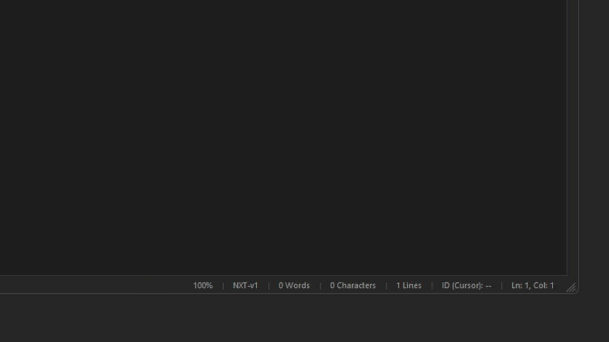

# Ninthpads: [Sidetrack]
**A Modern Notepad Substitute with Special Features, Automatic Saving, and Internal Data Storage.**

*Ever closed your Notepads and have lost your files? OR, have you ever wanted to focus on a specific text at a time?*
If so, you are in luck! Ninthpads has got you covered up!

## 🎯 The ID Highlighting System
The ID system is a simple but powerful focus tool. Text assigned with an ID stays dimmed until highlighted. 
Texts with the *same IDs* are highlighted simultaneously regardless of distance, 
while texts with *different IDs* remain dimmed,  allowing you to focus strictly on specific parts of your document.

## 📂 The Internal Explorer
Just like organizing files into folders on your computer, The Internal Explorer is here to make  your experience much better. 
It lets you save Ninthpads files without losing any of their special formatting data, all displayed in a tree-style structure. 
You can recolor, rename, and organize your files however you like.

## 💾 Asynchronous Saving
Well, the application needs a way to save your files temporarily when you close it without saving,
and also a place for the Explorer data. So what better way than using the "session.json" file?
With this file, we save your configurations, flags, items in the Explorer, and the retained files opened in the tabs.

## 🌐 Multi-Language Suport
Ninthpads has a multi-language support, currently suporting ***English US*** and ***Português Brasil*** *(Brazilian Portuguesse)*
If your application is in another language, don't worry! Just check the sidebar to change your current language.
Don’t forget to always review and adjust your settings to match your preferences and have your own touch!

## 🐜 A Lot of Bugs...
Despite everything, the application is always under development and may contain some bugs, both because it is a passion project and because parts of it were built in a somewhat “vibe-coded” way. Any future contributions and feedback are greatly appreciated. Whenever you find a bug, please report it to the DIversion Studios channel (https://www.youtube.com/@Diversion.Studios) or to the Issues tab on the GitHub repository.

We appreciate all the support, potential, and use of Ninthpads.
We hope that one day this becomes a massive community-driven project. 
And if one day we can say we truly made it, then we’ve won at life.

© 2024–2026 Diversion Studios. All rights reserved.

